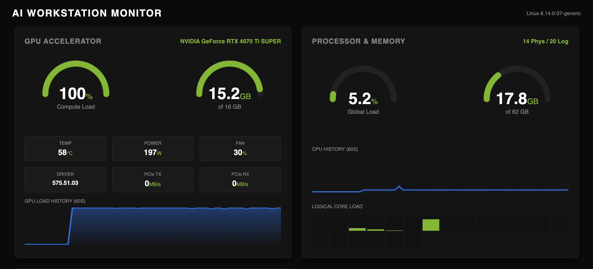

# ⚡ AI Workstation Monitor


A high-performance, single-file hardware monitoring dashboard designed for **Deep Learning Engineers**, **Data Scientists**, and **Power Users**.

Stop using `watch -n 1 nvidia-smi`. Get a professional, real-time visual cockpit of your workstation directly in your browser.



## 🚀 Why this monitor?

Most monitoring tools are either too simple (CLI based) or too heavy (Prometheus/Grafana stacks). This project bridges the gap:
* **Zero-Lag:** Uses lightweight HTML5 Canvas and Flask. No React/Vue overhead.
* **NVIDIA Native:** Deep integration with `pynvml` for precise GPU metrics (Power, Fan, VRAM, PCIe).
* **Process Inspector:** Instantly see *who* is hogging your RAM or VRAM.
* **Modern Stack:** Built with modern Python tooling (`uv`).
* **Robust:** Auto-detects hardware. Falls back to "CPU Mode" gracefully if no NVIDIA GPU is found.

## ✨ Features

* **Real-time GPU Telemetry:** Load, VRAM, Temperature, Power Draw (Watts), Fan Speed, PCIe Throughput.
* **System Metrics:** CPU Load (Global & Per-Core), RAM Usage, Swap Memory, SSD Storage.
* **Top Processes:** Live table of the most resource-intensive processes (CPU/MEM).
* **Dark Mode UI:** "Cyberpunk/NVIDIA" aesthetic designed for dark environments.

## 📦 Installation & Usage

This project uses **[uv](https://github.com/astral-sh/uv)** for ultra-fast dependency management.

### Prerequisites
* NVIDIA Drivers installed (for GPU metrics).
* [uv](https://docs.astral.sh/uv/getting-started/installation/) installed.

### 1. Clone the repository
```bash
git clone [https://github.com/hasso5703/ai-monitor.git](https://github.com/hasso5703/ai-monitor.git)
cd ai-monitor
```

### 2. Sync dependencies
Initialize the environment and install dependencies in milliseconds:
```bash
uv sync
```

### 3. Run the dashboard
Launch the monitor directly within the managed environment:
```bash
uv run main.py
```

Open your browser and navigate to:
* **Local:** `http://localhost:9999`
* **Network:** `http://<YOUR_PC_IP>:9999` (Perfect for monitoring from a tablet/phone)

## 🔧 Configuration

You can tweak the constants at the top of `main.py`:

```python
HOST = "0.0.0.0"      # Listen on all interfaces
PORT = 9999           # Web server port
HISTORY_SIZE = 60     # Seconds of history to keep in graphs
```

## 🛠️ Troubleshooting

**"No GPU Detected" / CPU Mode:**
If the dashboard runs but shows "No GPU", ensure you have NVIDIA drivers installed. The tool gracefully handles machines without GPUs (e.g., MacBooks, Laptops) by hiding the GPU panels.

**Missing Libraries:**
If `nvidia-ml-py` fails to load (e.g. on non-Linux systems), the script will automatically switch to CPU-only mode.

## 📄 License

[MIT](LICENSE)