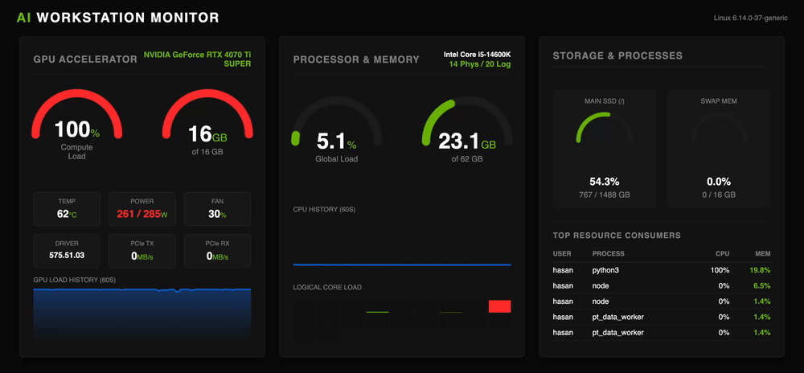

# ⚡ AI Workstation Monitor


A high-performance, single-file hardware monitoring dashboard designed for **Deep Learning Engineers**, **Data Scientists**, and **Power Users**.

Stop using `watch -n 1 nvidia-smi`. Get a professional, real-time visual cockpit of your workstation directly in your browser.



## 🚀 Why this monitor?

Most monitoring tools are either too simple (CLI based) or too heavy (Prometheus/Grafana stacks). This project bridges the gap:
* **Zero-Lag:** Uses lightweight HTML5 Canvas and Flask. No React/Vue overhead.
* **NVIDIA Native:** Deep integration with `pynvml` for precise GPU metrics (Power, Fan, VRAM, PCIe).
* **Process Inspector:** Instantly see *who* is hogging your RAM or VRAM.
* **Modern Stack:** Built with modern Python tooling (`uv`).
* **Robust:** Auto-detects hardware. Falls back to "CPU Mode" gracefully if no NVIDIA GPU is found.

## ✨ Features

* **Real-time GPU Telemetry:** Load, VRAM, Temperature, Power Draw (Watts), Fan Speed, PCIe Throughput.
* **System Metrics:** CPU Load (Global & Per-Core), RAM Usage, Swap Memory, SSD Storage.
* **Top Processes:** Live table of the most resource-intensive processes (CPU/MEM).
* **Dark Mode UI:** "Cyberpunk/NVIDIA" aesthetic designed for dark environments.

## 📦 Installation

This project uses **[uv](https://github.com/astral-sh/uv)** for ultra-fast dependency management.

### Prerequisites
* NVIDIA Drivers installed (for GPU metrics).
* [uv](https://docs.astral.sh/uv/getting-started/installation/) installed.

### 1. Clone the repository
```bash
git clone https://github.com/hasso5703/neurodash.git
cd neurodash
```

### 2. Sync dependencies
Initialize the environment and install dependencies in milliseconds:
```bash
uv sync
```

## 🚀 Usage

### Development / Quick Start
Launch the monitor directly within the managed environment for testing or personal use:
```bash
uv run main.py
```
*Access:* `http://localhost:9999`

### Production Deployment (Recommended)
For long-running AI workstations, use **Gunicorn** to ensure stability and performance without blocking resources.

**Option A: Manual Launch**
Use this command to run a single worker with multiple threads. This minimizes RAM usage while keeping the interface responsive.
```bash
uv run gunicorn -w 1 --threads 4 --worker-class gthread -b 0.0.0.0:9999 main:app
```

**Option B: Auto-Start on Boot (Linux/Ubuntu) 🐧**
Want the dashboard to start automatically when your workstation turns on?
We provide a one-line installer that sets up a `systemd` service for you.

1. **Run the installer:**
   ```bash
   chmod +x install_service.sh
   ./install_service.sh
   ```

2. **That's it!** The service will now run in the background and restart automatically if it crashes.

**Manage the service:**
* View logs: `sudo journalctl -u neurodash -f`
* Stop: `sudo systemctl stop neurodash`
* Restart: `sudo systemctl restart neurodash`

## 🌐 Remote Access

Since the monitor binds to `0.0.0.0`, it is accessible from any device on your network.

### 🏠 Local Network (WiFi/LAN)
Access the dashboard from your phone or tablet connected to the same WiFi/Ethernet:
`http://<YOUR_WORKSTATION_IP>:9999`

*(Example: `http://192.168.0.29:9999`)*

> **Tip:** Run `ip addr` or `ifconfig` in your terminal to find your local IP address.

### 🌍 Anywhere Access (Tailscale)
For secure remote monitoring outside your home (e.g., checking training status from a cafe), we recommend using **[Tailscale](https://tailscale.com/)**.

1. Install Tailscale on both your workstation and your mobile device.
2. Access the dashboard securely via your workstation's Tailscale IP:
   `http://<TAILSCALE_IP>:9999`

This method is secure (VPN) and does not require opening ports on your router.

## 🔧 Configuration

The application is configured via environment variables or default values in `main.py`:

| Variable | Default | Description |
| :--- | :--- | :--- |
| `HOST` | `0.0.0.0` | Listen on all interfaces |
| `PORT` | `9999` | Web server port |
| `UPDATE_INTERVAL` | `1000` | Refresh rate in ms |

## 🛠️ Troubleshooting

**"No GPU Detected" / CPU Mode:**
If the dashboard runs but shows "No GPU", ensure you have NVIDIA drivers installed. The tool gracefully handles machines without GPUs (e.g., MacBooks, Laptops) by hiding the GPU panels.

**Missing Libraries:**
If `nvidia-ml-py` fails to load (e.g. on non-Linux systems), the script will automatically switch to CPU-only mode.

## 📄 License

[MIT](LICENSE)